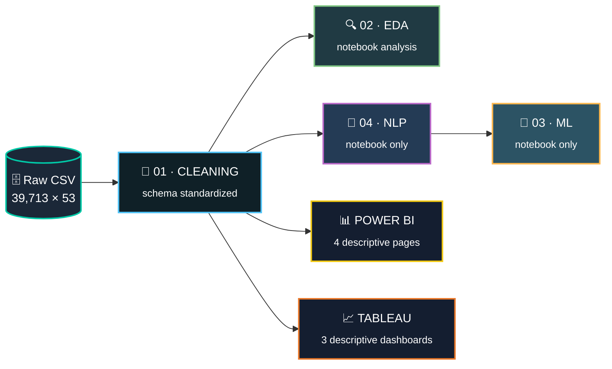

<div align="center">

<!-- ANIMATED HEADER -->


<!-- ANIMATED TYPING -->
<a href="#">
  
</a>

<br/>

<!-- TECH BADGES -->


<br/><br/>

<!-- STAT PILLS -->
<table>
<tr>
<td align="center"><h3>📊 39,713</h3><sub>Listings</sub></td>
<td align="center"><h3>🧬 53</h3><sub>Raw Columns</sub></td>
<td align="center"><h3>📓 4</h3><sub>Notebooks</sub></td>
<td align="center"><h3>📈 4+3</h3><sub>Dashboard Pages</sub></td>
<td align="center"><h3>🤖 6</h3><sub>ML Models</sub></td>
<td align="center"><h3>🗺️ 6</h3><sub>Cities</sub></td>
</tr>
</table>


</div>

---

## 📑 Table of Contents

<div align="center">

| | | | |
|:--:|:--:|:--:|:--:|
| [🎯 Overview](#-project-overview) | [🏗️ Architecture](#️-architectural-flow) | [🗃️ Dataset](#️-dataset) | [🌳 Structure](#-repository-structure) |
| [🔬 Notebooks](#-the-analytical-notebooks) | [📊 Dashboards](#-bi-dashboards-purely-descriptive) | [📦 Outputs](#-output-files) | [🚀 Setup](#-setup--installation) |
| [🧰 Libraries](#-libraries--dependencies) | [🧠 Design Decisions](#-design-decisions) |  [📜 License](#-license) |

</div>

---

## 🎯 Project Overview

> **A complete analytics pipeline on Egypt's real estate market** — from raw CSV ingestion all the way to interactive BI dashboards.

This project deliberately **separates concerns**:

- 🧪 **The Notebooks** are the *analytical engine* — where heavy statistical modeling, Machine Learning, and Natural Language Processing live.
- 📊 **The Dashboards** are the *reporting layer* — strictly descriptive & diagnostic, powered by clean data only, so they load instantly and stay easy to read for stakeholders.

**Business questions answered:**

<table>
<tr><td>🏙️</td><td><b>Which cities and property types command the highest price per sqm?</b></td></tr>
<tr><td>🏊</td><td><b>What amenities and specs correlate with price premiums?</b></td></tr>
<tr><td>📈</td><td><b>How does listing volume and price move across months and seasons?</b></td></tr>
<tr><td>💬</td><td><b>Do description sentiment & topics relate to price? <sub>(Notebook only)</sub></b></td></tr>
<tr><td>🤖</td><td><b>Can we predict price and classify Buy vs Rent? <sub>(Notebook only)</sub></b></td></tr>
</table>

---

## 🏗️ Architectural Flow

We separate **BI Reporting** (clean, fast, descriptive) from **Advanced Analytics** (notebook-based ML/NLP). The dashboards consume **only the cleaned dataset** — keeping them performant and clutter-free. ML/NLP outputs are captured as documented insights, not embedded visuals.



<div align="center">

**Legend:** Solid arrows = data flow · Both BI tools branch directly from the **clean layer** — never from ML/NLP outputs.

</div>

---

## 🗃️ Dataset

<div align="center">

| 🔖 Attribute | 📋 Detail |
|:---|:---|
| **Source** | PropertyFinder Egypt *(scraped March 2026)* |
| **Size** | `39,713 rows` × `53 columns` |
| **Coverage** | 🏛️ Cairo · 🐫 Giza · 🌊 North Coast · 🐠 Red Sea · ⚓ Suez · 🕌 Alexandria |
| **Offering Types** | `Buy` · `Rent` |
| **Currency** | Egyptian Pound (EGP) |
| **Grain** | One row = one property listing |

</div>

<details>
<summary><b>🔽 Click to expand — Full Column Dictionary</b></summary>

<br/>

| Group | Columns | Type |
|:---|:---|:---|
| 🆔 **Identity** | `listing_id`, `agent_id`, `broker_name` | ID / string |
| 💰 **Pricing** | `price_egp`, `offering_type` | numeric / categorical |
| 📐 **Specs** | `area_value`, `area_unit`, `bedrooms`, `bathrooms`, `property_type`, `furnished` | mixed |
| 🗺️ **Location** | `city`, `town`, `district`, `subdistrict`, `lat`, `lon` | string / geo |
| 📝 **Text** | `description`, `amenities` | free text / list-string |
| 🕒 **Temporal** | `listed_date`, `scraped_at` | datetime |
| 🏷️ **Quality Flags** | `is_premium`, `is_verified`, `is_featured` | boolean |

</details>

<details>
<summary><b>🔽 Click to expand — Engineered Columns (added in cleaning)</b></summary>

<br/>

| Column | Formula | Purpose |
|:---|:---|:---|
| `price_per_sqm` | `price_egp / area_value` | Normalizes price across property sizes |
| `bedroom_bathroom_ratio` | `bedrooms / bathrooms` | Layout efficiency signal |
| `days_since_listed` | `scraped_at − listed_date` | Listing freshness |
| `is_furnished_binary` | `1` if Furnished else `0` | ML-ready flag |
| `amenity_count` | count of amenities per listing | Feature richness proxy |
| `listing_age_days` | age at scrape time | Staleness detection |
| `year / month / week / day_of_week` | extracted from dates | Temporal grouping |

</details>

---

## 🌳 Repository Structure

```
egypt-real-estate-2026/
│
├── 📁 data/
│   └── 🗄️ egypt_re_raw.csv                 # Original scraped dataset (not versioned)
│
├── 📁 notebooks/
│   ├── 🧹 01_cleaning.ipynb                # Phase 1 — Cleaning & feature engineering
│   ├── 🔍 02_eda.ipynb                     # Phase 2 — Exploratory data analysis
│   ├── 🤖 03_outlier_ml.ipynb              # Phase 3 — Outliers, correlation & ML
│   └── 💬 04_nlp.ipynb                     # Phase 4 — NLP on descriptions
│
├── 📁 outputs/
│   ├── ✅ egypt_re_clean.csv               # → feeds BOTH dashboards
│   ├── ✅ egypt_re_amenities_binary.csv    # → feeds BOTH dashboards
│   ├── ✅ egypt_re_no_outliers.csv         # notebook-internal (ML)
│   ├── ✅ egypt_re_nlp.csv                 # notebook-internal (NLP)
│   ├── ✅ egypt_re_predictions.csv         # notebook-internal (ML report)
│   ├── ✅ feature_importance.csv           # notebook-internal (ML report)
│   └── ✅ eda_summary_stats.csv            # reference
│
├── 📁 eda_outputs/                         # All EDA charts saved as PNG
│   └── 🖼️ *.png
│
├── 📁 bi/
│   ├── 📊 powerbi/egypt_re_2026.pbip       # 4-page descriptive report
│   └── 📈 tableau/egypt_re_2026.twbx       # 3-dashboard descriptive workbook
│
├── 📁 docs/
│   ├── 📄 01_python_guide.md
│   ├── 📄 Powerbi_guide.md
│   └── 📄 Tableau_guide.md
│
├── 📋 requirements.txt
└── 📖 README.md
```

---

## 🔬 The Analytical Notebooks

<div align="center">


</div>

<br/>

<details open>
<summary><h3>🧹 Phase 1 — Data Cleaning &amp; Feature Engineering</h3></summary>

> 📓 `01_cleaning.ipynb` · 📤 Outputs → `egypt_re_clean.csv`, `egypt_re_amenities_binary.csv`

This notebook produces the **single source of truth** consumed by both dashboards.

| ✔️ | Step | Detail |
|:--:|:---|:---|
| 🕳️ | **Null audit** | Columns >40% null are documented, then dropped or imputed with justification. |
| 📉 | **Price outlier removal** | IQR applied **separately** for Buy & Rent to avoid cross-contamination of scales. |
| 🔢 | **Type coercion** | `bedrooms`/`bathrooms` parsed to numeric — `"Studio"` → `0`, `"10+"` → `10`. |
| 📐 | **Area validation** | Confirmed sqm via `area_unit`; flags for `<10` or `>50,000` sqm. |
| 📅 | **Date parsing** | Datetime conversion; `year/month/week/day_of_week` extracted. |
| 🛋️ | **Furnished normalization** | Collapsed to `Furnished` / `Unfurnished` / `Semi-Furnished`. |
| 🏊 | **Amenities parsing** | String-lists → real lists; top-20 amenities → binary flag columns. |
| 🔁 | **Deduplication** | On `listing_id`, keeping the most recent `scraped_at`. |

**➕ Engineered features:** `price_per_sqm`, `bedroom_bathroom_ratio`, `days_since_listed`, `is_furnished_binary`, `amenity_count`, `listing_age_days`.

</details>

<details open>
<summary><h3>🔍 Phase 2 — Exploratory Data Analysis</h3></summary>

> 📓 `02_eda.ipynb` · 📤 Outputs → `eda_outputs/*.png`, `eda_summary_stats.csv`

Full visual EDA across **five dimensions**, each chart titled and axis-labelled:

<table>
<tr>
<td width="18%" align="center"><h4>📊<br/>Univariate</h4></td>
<td>Log-scale price histograms (Buy vs Rent) · property-type counts · city distribution · bedroom & area distributions.</td>
</tr>
<tr>
<td align="center"><h4>🔗<br/>Bivariate</h4></td>
<td>Median price by city (Buy/Rent side-by-side) · price-vs-area scatter (log axes, colored by type) · price/sqm by bedroom · furnished boxplot · amenity count vs price.</td>
</tr>
<tr>
<td align="center"><h4>🕸️<br/>Multivariate</h4></td>
<td>Pearson correlation heatmap · pairplot of <code>price_per_sqm</code>, <code>area</code>, <code>bedrooms</code>, <code>amenity_count</code> (hue = <code>offering_type</code>).</td>
</tr>
<tr>
<td align="center"><h4>📅<br/>Temporal</h4></td>
<td>Listing volume by month · median price by month (Buy/Rent) · day-of-week posting volume.</td>
</tr>
<tr>
<td align="center"><h4>🗺️<br/>Geographic</h4></td>
<td>Lat/lon scatter colored by <code>price_per_sqm</code> · top-15 towns by listing count.</td>
</tr>
</table>

</details>

<details open>
<summary><h3>🤖 Phase 3 — Outlier Detection, Correlation &amp; Machine Learning</h3></summary>

> 📓 `03_outlier_ml.ipynb` · 📤 Outputs → `egypt_re_no_outliers.csv`, `egypt_re_predictions.csv`, `feature_importance.csv`
> ⚠️ **All outputs here stay inside the notebook ecosystem — none feed the dashboards.**

**📉 Outlier Detection**
- Z-score & IQR on `price_egp`, `area_value`, `price_per_sqm`, `bedrooms`, `bathrooms`.
- Per-column report: outlier count · % of total · min/max of outliers.
- `is_outlier` flag added; before/after distribution comparisons plotted.

**🕸️ Correlation Analysis**
- Pearson **vs** Spearman matrices compared.
- Point-biserial correlation between `price_egp` and 20 binary amenity flags.
- VIF check for multicollinearity among candidate features.

**🎯 Machine Learning Models**

<table>
<tr><th colspan="3">Target 1 — Price Regression <sub>(Buy & Rent trained separately)</sub></th></tr>
<tr><th>Model</th><th>Role</th><th>Notes</th></tr>
<tr><td>📏 Linear Regression</td><td><code>Baseline</code></td><td>—</td></tr>
<tr><td>🌲 Random Forest Regressor</td><td><code>Ensemble</code></td><td>Feature importance extracted</td></tr>
<tr><td>⚡ XGBoost Regressor</td><td><code>Boosted</code></td><td>Feature importance extracted</td></tr>
</table>

> 📐 Evaluated with `MAE` · `RMSE` · `R²` on 80/20 split **stratified by city**; residual plots included.

<table>
<tr><th colspan="3">Target 2 — Offering Type Classification <sub>(Buy vs Rent)</sub></th></tr>
<tr><th>Model</th><th>Role</th><th>Notes</th></tr>
<tr><td>📈 Logistic Regression</td><td><code>Baseline</code></td><td>—</td></tr>
<tr><td>🌲 Random Forest Classifier</td><td><code>Ensemble</code></td><td>—</td></tr>
<tr><td>⚡ XGBoost Classifier</td><td><code>Boosted</code></td><td>—</td></tr>
</table>

> 📐 Evaluated with `Accuracy` · `F1` · `Confusion Matrix` · `ROC-AUC`.

</details>

<details open>
<summary><h3>💬 Phase 4 — NLP on Descriptions</h3></summary>

> 📓 `04_nlp.ipynb` · 📤 Output → `egypt_re_nlp.csv`
> ⚠️ **Notebook-only. Sentiment & topics are reported as insights, not embedded in dashboards.**

| 🔬 | Stage | Detail |
|:--:|:---|:---|
| 🌐 | **Language detection** | `langdetect` splits English / Arabic subsets; counts reported. |
| 🔤 | **English NLP pipeline** | lowercase → punctuation strip → stopwords → lemmatize → top-30 word bar → TF-IDF (500 features) → WordCloud (Buy vs Rent). |
| 🧠 | **Topic modeling** | LDA with 5 topics; manually labelled; distribution by city plotted. |
| 😊 | **Sentiment analysis** | TextBlob/VADER → `sentiment_score` + `sentiment_label`; correlated with `price_per_sqm`. |

</details>

---

## 📊 BI Dashboards: Purely Descriptive


<br/>

### 🟡 Power BI — "The 4-Page Executive Suite"

> 📁 `bi/powerbi/egypt_re_2026.pbip` · 🔌 Source: `egypt_re_clean.csv`· ⭐ Star schema with DAX Calendar table.

<table>
<tr>
<th>#</th><th>📄 Page</th><th>🧩 Visuals Included</th>
</tr>
<tr>
<td><b>1</b></td>
<td><b>Market Overview</b></td>
<td>KPI cards (Total Listings, Avg Price EGP, Avg Price/sqm, Buy/Rent %) · donut of offering-type split · stacked bar of listings by city & property type · price-band histogram.</td>
</tr>
<tr>
<td><b>2</b></td>
<td><b>Location Intelligence</b></td>
<td>Filled/bubble map by district · drill-down matrix (City → Town → District) · Top-10 towns by listing count · avg price/sqm ranking by city.</td>
</tr>
<tr>
<td><b>3</b></td>
<td><b>Specs &amp; Pricing</b></td>
<td>Price/sqm by bedroom & bathroom count · furnished-status boxplot · area-vs-price scatter · amenity presence ranking (from binary table).</td>
</tr>
<tr>
<td><b>4</b></td>
<td><b>Temporal Trends</b></td>
<td>Monthly listing-volume line · median price by month (Buy vs Rent) · day-of-week posting bar · month × day-of-week seasonality heatmap.</td>
</tr>
</table>

<details>
<summary><b>🔽 Key DAX measures (all descriptive — no model outputs)</b></summary>

<br/>

```dax
Total Listings      = COUNTROWS ( Listings )
Avg Price EGP       = AVERAGE ( Listings[price_egp] )
Avg Price per Sqm   = AVERAGE ( Listings[price_per_sqm] )
Buy %               = DIVIDE ( CALCULATE ( [Total Listings], Listings[offering_type] = "Buy" ), [Total Listings] )
Median Price        = MEDIAN ( Listings[price_egp] )
MoM Volume Δ        = [Total Listings] - CALCULATE ( [Total Listings], DATEADD ( Calendar[Date], -1, MONTH ) )
Furnished Premium % = DIVIDE ( [Avg Furnished Price] - [Avg Unfurnished Price], [Avg Unfurnished Price] )
Amenity Presence %  = DIVIDE ( CALCULATE ( [Total Listings], Amenities[has_pool] = 1 ), [Total Listings] )
```
</details>

<br/>

### 🟠 Tableau — "Descriptive Exploration" (3 Dashboards)

> 📁 `bi/tableau/egypt_re_2026.twbx` · 
<table>
<tr>
<th>#</th><th>📄 Dashboard</th><th>🧩 Visuals Included</th>
</tr>
<tr>
<td><b>1</b></td>
<td><b>Geospatial Explorer</b></td>
<td>Dark-background point map of listings · compound/town price-density hexbins · Top-30 towns by avg price/sqm ranking · custom tooltips (price, area, beds).</td>
</tr>
<tr>
<td><b>2</b></td>
<td><b>Yield &amp; Category Analysis</b></td>
<td>Rental-yield % bubble map by town (LOD-calculated) · property-type comparison bars · Buy-vs-Rent dual-axis by district · furnished mix by city.</td>
</tr>
<tr>
<td><b>3</b></td>
<td><b>Temporal Momentum</b></td>
<td>Month × Day heatmap · quarterly dual-axis price trend · city price trajectories over time · listing-age band stacked bar.</td>
</tr>
</table>

> 🎨 Custom palettes — `EgyptRE PropertyType` · `EgyptRE Yield` · `EgyptRE Temporal` — defined in `Preferences.tps`.
> 🧮 **LOD expressions** compute city- and town-level rental yields directly from clean data (no external model file).

---

## 📦 Output Files

<div align="center">

| 📄 File | 🏭 Produced by | 🎯 Consumed by |
|:---|:---|:---|
| `egypt_re_clean.csv` | 🧹 `01_cleaning` | **Power BI · Tableau** · all notebooks |
| `egypt_re_amenities_binary.csv` | 🧹 `01_cleaning` | **Power BI · Tableau** |
| `egypt_re_no_outliers.csv` | 🤖 `03_outlier_ml` | Notebook ML section only |
| `egypt_re_nlp.csv` | 💬 `04_nlp` | Notebook ML section only |
| `egypt_re_predictions.csv` | 🤖 `03_outlier_ml` | Docs / reporting only |
| `feature_importance.csv` | 🤖 `03_outlier_ml` | Docs / reporting only |
| `eda_summary_stats.csv` | 🔍 `02_eda` | Reference |

</div>

> 🔒 **Notice:** Only the first two files reach the dashboards. Everything else remains inside the analytical / documentation layer.

---

## 🚀 Setup & Installation

<div align="center">

```
STEP 1 ─▶ STEP 2 ─▶ STEP 3 ─▶ STEP 4 ─▶ STEP 5 ─▶ STEP 6
 clone      venv     install    data     notebooks    BI
```

</div>

<details open>
<summary><b>1️⃣ Clone the repository</b></summary>

```bash
git clone https://github.com/your-username/egypt-real-estate-2026.git
cd egypt-real-estate-2026
```
</details>

<details open>
<summary><b>2️⃣ Create a virtual environment</b></summary>

```bash
python -m venv venv
source venv/bin/activate        # 🐧 macOS / Linux
venv\Scripts\activate           # 🪟 Windows
```
</details>

<details open>
<summary><b>3️⃣ Install dependencies</b></summary>

```bash
pip install -r requirements.txt
```
</details>

<details open>
<summary><b>4️⃣ Place the raw data file</b></summary>

Copy `egypt_re_raw.csv` into `data/`. Notebooks reference it via `../data/egypt_re_raw.csv`.
</details>

<details open>
<summary><b>5️⃣ Run notebooks in order</b></summary>

```bash
jupyter notebook
```

<div align="center">

`01_cleaning` ➜ `02_eda` ➜ `04_nlp` ➜ `03_outlier_ml`

</div>

> [!IMPORTANT]
> Run `04_nlp` **before** `03_outlier_ml` — the ML section reads NLP-derived columns from `egypt_re_nlp.csv`.
> Dashboards only need `01_cleaning` to have run at minimum.

</details>

<details open>
<summary><b>6️⃣ Open the BI files</b></summary>

| Tool | Instruction |
|:---|:---|
| 🟡 **Power BI** | Open `bi/powerbi/egypt_re_2026.pbip` in Power BI Desktop. Update the Power Query source path if `outputs/` differs. |
| 🟠 **Tableau** | Open `bi/tableau/egypt_re_2026.twbx` in Tableau Desktop. Data is embedded. |

</details>

---

## 🧰 Libraries & Dependencies

<div align="center">

| 🗂️ Category | 📦 Packages |
|:---|:---|
| **Core Data** | `pandas>=2.0` · `numpy>=1.24` · `scipy>=1.11` |
| **Visualization** | `matplotlib>=3.7` · `seaborn>=0.12` · `wordcloud>=1.9` |
| **Machine Learning** | `scikit-learn>=1.3` · `xgboost>=2.0` |
| **NLP** | `nltk>=3.8` · `textblob>=0.17` · `vaderSentiment>=3.3` · `langdetect>=1.0` |
| **Environment** | `jupyter>=1.0` · `ipykernel>=6.0` |

</div>

```bash
pip install -r requirements.txt
```

---

## 🧠 Design Decisions

<table>
<tr>
<td width="4%">💡</td>
<td><b>Why keep ML & NLP out of the dashboards?</b><br/>
<sub>Embedding model scores creates fragile, slow reports that break when the model changes. By feeding dashboards only <b>clean, factual data</b>, they stay fast, deterministic, and trustworthy for executives — while the notebooks remain the flexible experimentation ground.</sub></td>
</tr>
<tr>
<td>💡</td>
<td><b>Why IQR per offering type for price outliers?</b><br/>
<sub>Buy (millions EGP) and Rent (thousands EGP/month) occupy totally different scales. Pooling them would flag normal rents as outliers against the Buy distribution.</sub></td>
</tr>
<tr>
<td>💡</td>
<td><b>Why keep both Pearson and Spearman?</b><br/>
<sub>Price data is right-skewed. Spearman captures monotonic relationships Pearson misses on non-normal distributions — a more robust view of what co-moves with price.</sub></td>
</tr>
<tr>
<td>💡</td>
<td><b>Why merge outlier detection and ML into one notebook?</b><br/>
<sub>Outlier removal directly produces the clean set that feeds the models. Keeping them together makes the flow explicit and avoids re-loading/re-validating between phases.</sub></td>
</tr>
<tr>
<td>💡</td>
<td><b>Power BI (4 pages) vs Tableau (3 dashboards) split.</b><br/>
<sub>Power BI handles structured executive reporting via reusable DAX. Tableau handles richer geospatial density mapping and LOD-based yield analysis. Both stay strictly descriptive.</sub></td>
</tr>
<tr>
<td>💡</td>
<td><b>No hardcoded paths.</b><br/>
<sub>All notebooks use relative paths from the project root, so the project runs anywhere it is cloned.</sub></td>
</tr>
</table>

---


## 📜 License

<div align="center">

This project is for **educational and portfolio purposes**.
The underlying dataset was scraped from a public real estate portal and is **not redistributed here**.

<br/>

⭐ **If you found this project useful, consider giving it a star!** ⭐

<br/>


</div>
